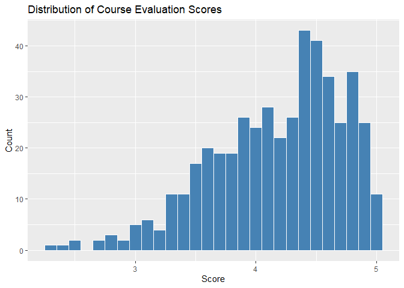
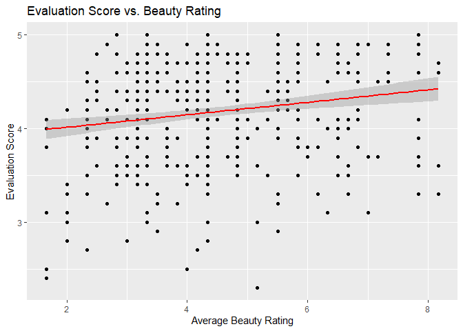
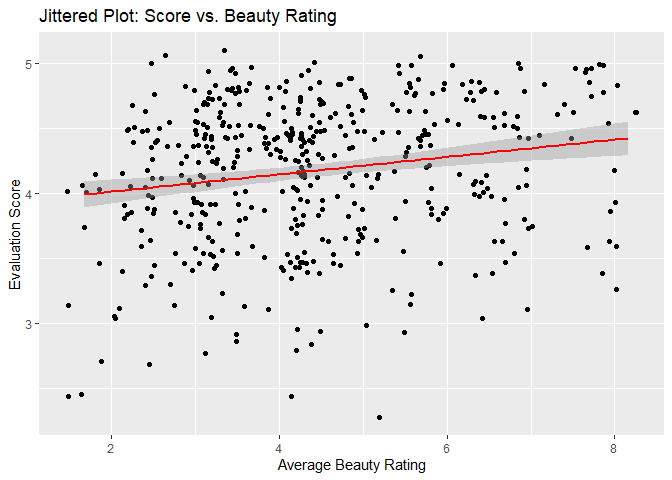
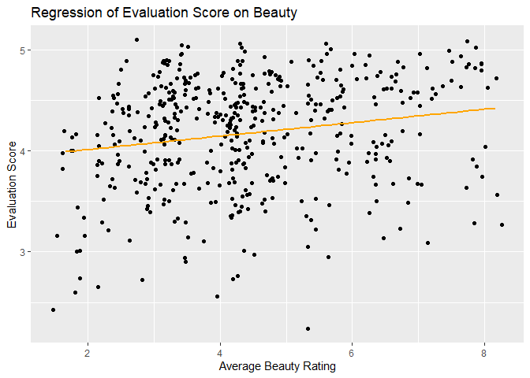

Lab 10 - Grading the professor, Pt. 1
================
Jamieson Nathan
4/20/2025

## Load Packages and Data

``` r
library(tidyverse) 
library(broom)
library(openintro)

data(evals)
?evals  
glimpse(evals)  
```

    ## Rows: 463
    ## Columns: 23
    ## $ course_id     <int> 1, 2, 3, 4, 5, 6, 7, 8, 9, 10, 11, 12, 13, 14, 15, 16, 1…
    ## $ prof_id       <int> 1, 1, 1, 1, 2, 2, 2, 3, 3, 4, 4, 4, 4, 4, 4, 4, 4, 5, 5,…
    ## $ score         <dbl> 4.7, 4.1, 3.9, 4.8, 4.6, 4.3, 2.8, 4.1, 3.4, 4.5, 3.8, 4…
    ## $ rank          <fct> tenure track, tenure track, tenure track, tenure track, …
    ## $ ethnicity     <fct> minority, minority, minority, minority, not minority, no…
    ## $ gender        <fct> female, female, female, female, male, male, male, male, …
    ## $ language      <fct> english, english, english, english, english, english, en…
    ## $ age           <int> 36, 36, 36, 36, 59, 59, 59, 51, 51, 40, 40, 40, 40, 40, …
    ## $ cls_perc_eval <dbl> 55.81395, 68.80000, 60.80000, 62.60163, 85.00000, 87.500…
    ## $ cls_did_eval  <int> 24, 86, 76, 77, 17, 35, 39, 55, 111, 40, 24, 24, 17, 14,…
    ## $ cls_students  <int> 43, 125, 125, 123, 20, 40, 44, 55, 195, 46, 27, 25, 20, …
    ## $ cls_level     <fct> upper, upper, upper, upper, upper, upper, upper, upper, …
    ## $ cls_profs     <fct> single, single, single, single, multiple, multiple, mult…
    ## $ cls_credits   <fct> multi credit, multi credit, multi credit, multi credit, …
    ## $ bty_f1lower   <int> 5, 5, 5, 5, 4, 4, 4, 5, 5, 2, 2, 2, 2, 2, 2, 2, 2, 7, 7,…
    ## $ bty_f1upper   <int> 7, 7, 7, 7, 4, 4, 4, 2, 2, 5, 5, 5, 5, 5, 5, 5, 5, 9, 9,…
    ## $ bty_f2upper   <int> 6, 6, 6, 6, 2, 2, 2, 5, 5, 4, 4, 4, 4, 4, 4, 4, 4, 9, 9,…
    ## $ bty_m1lower   <int> 2, 2, 2, 2, 2, 2, 2, 2, 2, 3, 3, 3, 3, 3, 3, 3, 3, 7, 7,…
    ## $ bty_m1upper   <int> 4, 4, 4, 4, 3, 3, 3, 3, 3, 3, 3, 3, 3, 3, 3, 3, 3, 6, 6,…
    ## $ bty_m2upper   <int> 6, 6, 6, 6, 3, 3, 3, 3, 3, 2, 2, 2, 2, 2, 2, 2, 2, 6, 6,…
    ## $ bty_avg       <dbl> 5.000, 5.000, 5.000, 5.000, 3.000, 3.000, 3.000, 3.333, …
    ## $ pic_outfit    <fct> not formal, not formal, not formal, not formal, not form…
    ## $ pic_color     <fct> color, color, color, color, color, color, color, color, …

## Exercise 1

``` r
# Histogram of evaluation scores
ggplot(evals, aes(x = score)) +
  geom_histogram(binwidth = 0.1, fill = "steelblue", color = "white") +
  labs(title = "Distribution of Course Evaluation Scores", x = "Score", y = "Count")
```

<!-- -->

``` r
# Summary statistics
summary(evals$score)
```

    ##    Min. 1st Qu.  Median    Mean 3rd Qu.    Max. 
    ##   2.300   3.800   4.300   4.175   4.600   5.000

``` r
ggplot(evals, aes(x = bty_avg, y = score)) +
  geom_point() +
  geom_smooth(method = "lm", se = TRUE, color = "red") +
  labs(title = "Evaluation Score vs. Beauty Rating",
       x = "Average Beauty Rating",
       y = "Evaluation Score")
```

    ## `geom_smooth()` using formula = 'y ~ x'

<!-- -->

``` r
ggplot(evals, aes(x = bty_avg, y = score)) +
  geom_jitter(width = 0.2, height = 0.1) +
  geom_smooth(method = "lm", se = TRUE, color = "red") +
  labs(title = "Jittered Plot: Score vs. Beauty Rating",
       x = "Average Beauty Rating",
       y = "Evaluation Score")
```

    ## `geom_smooth()` using formula = 'y ~ x'

<!-- -->

The histogram is left-skewed showing that typically students give high
ratings (4-5). This is reaffirmed by the summary output which shows a
means of almost 4.2.

The scatter plot indicates some sort of upward linear trend, which may
suggest that more attractive teachers get slightly higher scores,
however, there is a lot of noise and I would be hesitant to conclude
that definitely.

The jittered plot helps visualize the density a lot more, and helps give
a more accurate impression of frequencies.

## Exercise 2

``` r
m_bty <- lm(score ~ bty_avg, data = evals)
summary(m_bty)
```

    ## 
    ## Call:
    ## lm(formula = score ~ bty_avg, data = evals)
    ## 
    ## Residuals:
    ##     Min      1Q  Median      3Q     Max 
    ## -1.9246 -0.3690  0.1420  0.3977  0.9309 
    ## 
    ## Coefficients:
    ##             Estimate Std. Error t value Pr(>|t|)    
    ## (Intercept)  3.88034    0.07614   50.96  < 2e-16 ***
    ## bty_avg      0.06664    0.01629    4.09 5.08e-05 ***
    ## ---
    ## Signif. codes:  0 '***' 0.001 '**' 0.01 '*' 0.05 '.' 0.1 ' ' 1
    ## 
    ## Residual standard error: 0.5348 on 461 degrees of freedom
    ## Multiple R-squared:  0.03502,    Adjusted R-squared:  0.03293 
    ## F-statistic: 16.73 on 1 and 461 DF,  p-value: 5.083e-05

So the linera model is **y^ =3.88+0.067⋅bty_avg**

``` r
ggplot(evals, aes(x = bty_avg, y = score)) +
  geom_jitter(width = 0.2, height = 0.1) +
  geom_smooth(method = "lm", se = FALSE, color = "orange") +
  labs(title = "Regression of Evaluation Score on Beauty",
       x = "Average Beauty Rating",
       y = "Evaluation Score")
```

    ## `geom_smooth()` using formula = 'y ~ x'

<!-- -->

``` r
summary(m_bty)$r.squared
```

    ## [1] 0.03502226

The shaded area is the confidence interval around the regression line.
You are asking us to turn it off to focus only on the trend, without
being distracted by the uncertainty visualization.

Since The slope is about 0.06, for every 1-point increase in average
beauty rating, a professor’s evaluation score increases by 0.067 points,
on average.So, yes, beauty does have a small but positive effect on
evaluation scores.

The intercept is 3.88, which is the predicted evaluation score for a
professor with a beauty rating of 0. Since beauty ratings don’t actually
go that low in this data set, the intercept is a mathematical artifact
here.

Looking at the R^2 value, only about 3.5% of the variation in evaluation
scores is explained by beauty ratings.So beauty does have a measurable
effect, but it’s not a strong predictor and most of the variation in
evaluation scores is due to other factors.

## Exercise 3

``` r
m_gen <- lm(score ~ gender, data = evals)
tidy(m_gen)
```

    ## # A tibble: 2 × 5
    ##   term        estimate std.error statistic p.value
    ##   <chr>          <dbl>     <dbl>     <dbl>   <dbl>
    ## 1 (Intercept)    4.09     0.0387    106.   0      
    ## 2 gendermale     0.142    0.0508      2.78 0.00558

The intercept always corresponds to the reference category of the
categorical variable—in this case. On average, male professors score
0.142 points higher than female professors in student evaluations. The
p-value (0.00558) shows this difference is statistically significant at
the 0.01 level.

Line equations: y^males = 4.09 + 0.142 = 4.232, y^females = 4.09

``` r
m_rank <- lm(score ~ rank, data = evals)
tidy(m_rank)
```

    ## # A tibble: 3 × 5
    ##   term             estimate std.error statistic   p.value
    ##   <chr>               <dbl>     <dbl>     <dbl>     <dbl>
    ## 1 (Intercept)         4.28     0.0537     79.9  1.02e-271
    ## 2 ranktenure track   -0.130    0.0748     -1.73 8.37e-  2
    ## 3 ranktenured        -0.145    0.0636     -2.28 2.28e-  2

Tenure track professors are rated 0.13 points lower and tenured
professors 0.15 points lower than non-tenure track professors (intercept
= 4.28), suggesting a small but significant decrease in evaluations with
seniority.

## Exercise 1

``` r
# Relevel so "tenured" is the reference
evals <- evals %>%
  mutate(rank_relevel = relevel(rank, ref = "tenured"))

# Fit model
m_rank_relevel <- lm(score ~ rank_relevel, data = evals)
summary(m_rank_relevel)
```

    ## 
    ## Call:
    ## lm(formula = score ~ rank_relevel, data = evals)
    ## 
    ## Residuals:
    ##     Min      1Q  Median      3Q     Max 
    ## -1.8546 -0.3391  0.1157  0.4305  0.8609 
    ## 
    ## Coefficients:
    ##                          Estimate Std. Error t value Pr(>|t|)    
    ## (Intercept)               4.13913    0.03407 121.500   <2e-16 ***
    ## rank_relevelteaching      0.14518    0.06355   2.284   0.0228 *  
    ## rank_releveltenure track  0.01550    0.06228   0.249   0.8036    
    ## ---
    ## Signif. codes:  0 '***' 0.001 '**' 0.01 '*' 0.05 '.' 0.1 ' ' 1
    ## 
    ## Residual standard error: 0.5419 on 460 degrees of freedom
    ## Multiple R-squared:  0.01163,    Adjusted R-squared:  0.007332 
    ## F-statistic: 2.706 on 2 and 460 DF,  p-value: 0.06786

``` r
summary(m_rank_relevel)$r.squared
```

    ## [1] 0.01162894

Using relevel sets tenured professors as the reference group, so the
model compares other ranks against tenured. In this model, tenured
professors average a score of 4.139; non-tenure track professors score
0.145 points higher, and tenure track professors score just 0.016 points
higher. Rank explains only 1.13% of the variation in evaluation scores,
indicating it’s not a strong predictor.

``` r
evals <- evals %>%
  mutate(tenure_eligible = ifelse(rank == "teaching", "no", "yes")) %>%
  mutate(tenure_eligible = factor(tenure_eligible))

m_tenure_eligible <- lm(score ~ tenure_eligible, data = evals)
summary(m_tenure_eligible)
```

    ## 
    ## Call:
    ## lm(formula = score ~ tenure_eligible, data = evals)
    ## 
    ## Residuals:
    ##     Min      1Q  Median      3Q     Max 
    ## -1.8438 -0.3438  0.1157  0.4360  0.8562 
    ## 
    ## Coefficients:
    ##                    Estimate Std. Error t value Pr(>|t|)    
    ## (Intercept)          4.2843     0.0536  79.934   <2e-16 ***
    ## tenure_eligibleyes  -0.1406     0.0607  -2.315    0.021 *  
    ## ---
    ## Signif. codes:  0 '***' 0.001 '**' 0.01 '*' 0.05 '.' 0.1 ' ' 1
    ## 
    ## Residual standard error: 0.5413 on 461 degrees of freedom
    ## Multiple R-squared:  0.0115, Adjusted R-squared:  0.009352 
    ## F-statistic: 5.361 on 1 and 461 DF,  p-value: 0.02103

``` r
summary(m_tenure_eligible)$r.squared
```

    ## [1] 0.01149589

Tenure-eligible professors score 0.112 points lower on average than
non-tenure faculty (who average 4.284), but tenure eligibility explains
only 0.66% of the variation in evaluation scores, making it a weak
predictor.
